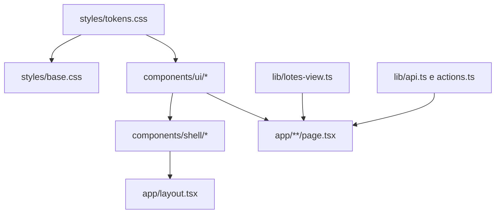

# Redesign v2 do AdPub Design

**Spec**: `.specs/features/redesign-v2/spec.md`
**Status**: Draft

---

## Architecture Overview

O front é Next 16 (App Router) com server components que chamam a API Fastify por `lib/api.ts` e server actions por rota. **Nada disso muda.** O redesign troca apenas a camada de apresentação: tokens, primitivos, casca e o layout de cada rota.



Camadas e responsabilidade:

| Camada | Arquivos | Regra |
| ------ | -------- | ----- |
| Tokens | `src/styles/tokens.css` | Única fonte de cor, raio, tipo e espaço. Claro em `:root`, escuro em `[data-theme="dark"]` e no `prefers-color-scheme` quando `data-theme="system"`. |
| Base | `src/styles/base.css` | Reset, tipografia, foco, utilitários `ap-*`. |
| Primitivos | `src/components/ui/*.tsx` | API igual à do Astryx usada hoje, para a troca de import ser mecânica. |
| Casca | `src/components/shell/*.tsx` | Barra superior, rodapé, barra inferior mobile. |
| Visão | `src/lib/lotes-view.ts` | Funções puras: agrupar anúncios por estado, contar atenção, segmentos de pipeline, fila de publicação. Sem imports com alias `@/`, para o Vitest rodar sem config. |
| Rotas | `src/app/**` | Mantêm busca de dados e server actions; só o JSX e as classes mudam. |

## Code Reuse Analysis

### Existing Components to Leverage

| Componente | Local | Como usar |
| ---------- | ----- | --------- |
| Rótulos PT (`STATUS_PT`, `ctaLabel`, `formatLabel`, `moedaLabel`, `plural`) | `components/ui.tsx` | Mantidos, movidos para `lib/labels.ts` sem mudar a assinatura. |
| `PageHead`, `Card`, `Badge`, `Table`, `Empty`, `Field` | `components/ui.tsx` | Reimplementados com a mesma assinatura em `components/ui/`. |
| `ThemePreference` e cookie `adpub_theme` | `components/providers.tsx` | Mantém o contexto e o cookie; remove o `Theme` do Astryx. |
| `item-editor`, `publish-panel`, `reconciliation-panel`, `batch-items-table`, `manual-builder` | `app/lotes/[id]/` | Mantêm lógica e `aria`; recebem novo layout. |
| `ad-preview.tsx` | `components/` | Vira a prévia da ficha. |
| Server actions e `lib/api.ts`, `lib/session.ts`, `lib/types.ts` | `app/**/actions.ts`, `lib/` | Intocados. |

### Integration Points

| Sistema | Método |
| ------- | ------ |
| API Fastify | `api<T>()` em server components, sem novo endpoint |
| Sessão e papel | `requireSession()` e `user.role` |
| Flags | `process.env.FEATURE_*` (menu) |
| e2e | Playwright em `e2e/`, harness `scripts/e2e/server.ts` |

## Components

### `ui/Button` e `ui/ButtonLink`
- **Purpose**: botão e link-botão com as variantes do Figma.
- **Interfaces**: `{ variant: 'primary'|'secondary'|'ghost'|'destructive'; label: string; isDisabled?; onClick?; type?; href?; as? }`, a mesma lista que o código usa hoje.
- **Dependencies**: `tokens.css`.
- **Reuses**: assinatura do `@astryxdesign/core/Button`.

### `ui/Selo`
- **Purpose**: selo de estado com 13 variantes (Rascunho, Bloqueado, Pronto, Na fila, Publicando, Publicado, Em análise, Aprovado, Reprovado, Falhou, Conferir, Somente leitura, Ativa).
- **Interfaces**: `selo(status: string): { tone: SeloTone; label: string }` mais o componente `<Selo status />`. O `Badge` atual passa a chamar `<Selo>`.
- **Reuses**: `STATUS_PT`.

### `ui/Table`, `TableRow`, `TableCell`
- **Purpose**: tabela semântica (`<table>`) com cabeçalho de duas linhas e rolagem contida.
- **Interfaces**: `Table({ head, children, className })` e `TableRow`, `TableCell` iguais às de hoje.

### `ui/Dialog`
- **Purpose**: janela modal com `role="dialog"`, foco preso e Esc.
- **Interfaces**: mesma assinatura usada nos 4 arquivos atuais.
- **Dependencies**: elemento nativo `<dialog>`.

### `ui/Field`, `Input`, `Select`, `Textarea`, `Checkbox`, `Chip`, `Callout`, `Empty`
- **Purpose**: formulários e blocos de aviso com `label`/`aria-describedby` corretos.
- **Interfaces**: `Field` mantém `{ label, hint, children, className }`.

### `shell/TopBar`
- **Purpose**: marca, 5 abas (Contas e Gestão como menus), busca, sincronização, avatar e Sair.
- **Interfaces**: `{ user: SessionUser; groups: NavGroup[]; syncedAt?: string }`.
- **Reuses**: `visibleNav()` do `layout.tsx` (movido para `lib/nav.ts`, sem mudar a regra de papel e flag).

### `shell/BottomNav` e rota `/mais`
- **Purpose**: navegação mobile (até 768 px) e a página com os demais destinos e a aparência.

### `shell/Footer`
- **Purpose**: rodapé com produto, tela e os atalhos implementados.

### `lib/lotes-view.ts`
- **Purpose**: derivar tudo que a lista de lotes mostra.
- **Interfaces**:
  - `ESTADOS: readonly EstadoGrupo[]` (11 grupos, ordem do Figma mais Falhou e Conferir);
  - `grupoDoItem(status: AdDraftStatus): EstadoGrupo`;
  - `contarPorGrupo(batches: Batch[]): Record<EstadoGrupo, number>`;
  - `precisamAtencao(contagem): number`;
  - `segmentosDoLote(batch: Batch): Array<{ grupo: EstadoGrupo; n: number }>`;
  - `filaDePublicacao(batches: Batch[]): Batch[]`;
  - `filtrarPorGrupo(batches, grupo?): Batch[]`.

## Data Models

### EstadoGrupo
```typescript
type EstadoGrupo =
  | 'rascunho' | 'bloqueado' | 'pronto' | 'fila' | 'publicando'
  | 'publicado' | 'analise' | 'aprovado' | 'reprovado' | 'falhou' | 'conferir';
```
Mapa (de `AdDraftStatus`): `draft→rascunho`, `blocked→bloqueado`, `ready→pronto`, `queued→fila`, `uploading_media|ensuring_campaign|ensuring_adset|creating_creative|creating_ad→publicando`, `published→publicado`, `in_review→analise`, `approved→aprovado`, `disapproved→reprovado`, `failed→falhou`, `needs_reconciliation→conferir`. Atenção = bloqueado, reprovado, falhou e conferir.

## Error Handling Strategy

| Cenário | Tratamento | Impacto |
| ------- | ---------- | ------- |
| API de contas falha na casca | `try/catch` no layout, rótulo de sincronização omitido | Nenhum erro visível |
| Rota não carrega | `error.tsx` com mensagem, código da requisição e "Tentar de novo" | Usuário tenta de novo |
| Cookie de tema inválido | Cai para `system` | Nenhum |
| Lote sem anúncios | Segmentos vazios, largura 0, sem divisão por zero | Barra vazia |

## Risks & Concerns

| Risco | Mitigação |
| ----- | --------- |
| 16 jornadas e2e dependem de nomes de botão e texto | Preservar `aria`; mudar texto só onde o Figma muda (lista em T24) |
| Meio app quebrado enquanto migra | `legacy.css` fica até T23; CSS novo usa prefixo `ap-` |
| Dois conjuntos de estilo disputando especificidade | Camada `@layer legacy, ap;` com `ap` por último |
| Escuro derivado sem desenho | Checagem de contraste 4,5:1 em T25 e captura do escuro por rota principal |
| Tabela larga em 390 px | Cartões em até 768 px (RDS-16), rolagem contida só onde há dado tabular |
| Fonte via rede no build | `@fontsource-variable/nunito` e `geist` empacotados (RDS-03) |

## Tech Decisions (only non-obvious ones)

| Decisão | Escolha | Racional |
| ------- | ------- | -------- |
| Biblioteca de UI | Remover o Astryx e escrever primitivos próprios com a mesma API | O Figma exige pílulas, selos e tabelas que o Astryx não entrega; a API igual torna a troca mecânica |
| Estilo | CSS puro com variáveis, em arquivos, sem Tailwind para o novo | O repo já tem Tailwind 4, mas o desenho é de tokens e componentes semânticos; classes `ap-*` ficam legíveis |
| Teste de UI | `renderToStaticMarkup` no Vitest para primitivos e Playwright para rotas | Não há jsdom nem Testing Library no repo; evita nova dependência |
| Estado do filtro | Parâmetro de URL | Funciona sem JS e é compartilhável |
