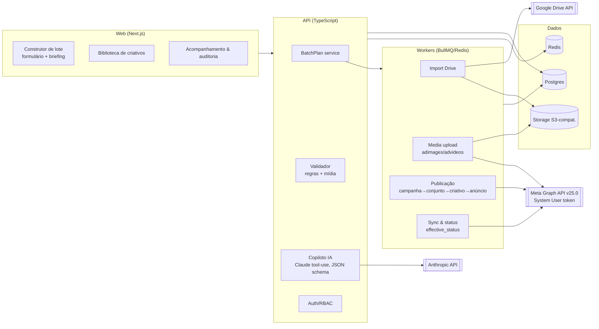
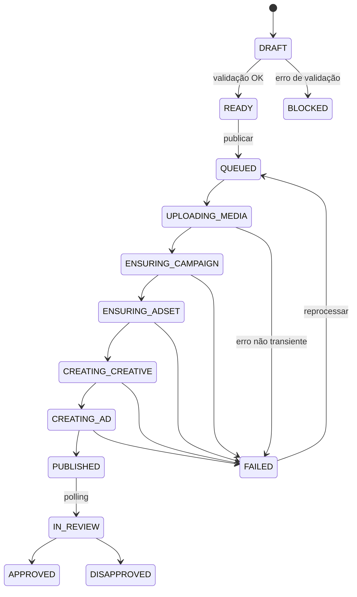

# PRD — Publicador de Anúncios Meta via IA (codinome: **AdPub**)

| Campo | Valor |
|---|---|
| Versão | 1.0 (rascunho para validação) |
| Data | 08/09/2026 |
| Dono do produto | Head de Tráfego (a definir) |
| Stakeholders | Gestores de tráfego (17 contas), Coordenação de tráfego, TI/Admin da BM |
| Status | Em revisão |

---

## 1. Resumo executivo

Hoje a operação sobe em média **80 anúncios/dia** em **17 contas de anúncio** (todas dentro de uma única Business Manager) manualmente pelo Gerenciador de Anúncios. Cada subida manual consome de 4 a 8 minutos de gestor por anúncio, gera erros de nomenclatura/UTM/página vinculada e não deixa rastro auditável.

O **AdPub** é uma aplicação web interna que transforma um **briefing** (texto, planilha ou pasta de criativos no Google Drive) em um **lote de anúncios pronto para publicar** — com copies geradas/ajustadas por IA, validação de política e de mídia antes de tocar na Meta, e um **pipeline de publicação resiliente** (fila, retry, idempotência, respeito aos rate limits) que cria campanhas, conjuntos, criativos e anúncios via **Marketing API v25.0** usando o **System User da BM**.

**O que a IA faz:** interpreta o briefing, propõe a estrutura do lote, gera variações de copy no tom do cliente, faz pré-checagem de política e sugere nomenclatura.
**O que a IA não faz:** não publica sozinha, não define orçamento nem público sem confirmação humana, não ativa anúncio (padrão `PAUSED`).

**Meta de negócio:** reduzir o esforço humano por anúncio de ~5 min para **≤ 45 s** (lote), com taxa de erro de publicação **< 2 %** e 100 % das ações auditadas, em 60 dias após o lançamento do MVP.

---

## 2. Contexto e problema

### 2.1 Situação atual
- 17 contas de clientes sob 1 BM; ~80 subidas/dia (≈ 4,7 por conta/dia, com picos concentrados em lançamentos e datas sazonais).
- Fluxo manual: gestor recebe criativos (Drive/WhatsApp) → abre o Ads Manager → duplica conjunto → troca mídia → cola copy → ajusta nome/UTM → publica → repete.
- Dores relatadas (hipóteses a validar com os gestores na semana 1):
  1. Tempo: subida repetitiva consome a agenda que deveria ser de otimização.
  2. Erro humano: página/Instagram errado, UTM inconsistente, nomenclatura fora do padrão, copy com claim que a Meta reprova.
  3. Sem rastreabilidade: quem subiu o quê, quando, com qual criativo.
  4. Sem padrão entre gestores: cada um tem sua "receita".

### 2.2 Por que agora
- A Meta consolidou o acesso à Marketing API em dois tiers (Limited/Full) e reduziu o limiar para Full Access (500 chamadas em 15 dias), o que torna viável para uma operação do nosso porte obter acesso de produção.
- A Meta lançou um MCP oficial (abril/2026) e a comunidade tem vários servidores MCP maduros — há muito código de referência para reutilizar (ver `research/analise-open-source.md`).
- Bloqueio de campanhas ASC/AAC legadas via API (maio/2026) e v26 prevista para ~setembro: qualquer ferramenta nova já nasce no fluxo unificado Advantage+.

---

## 3. Objetivos e métricas

| # | Objetivo | Métrica | Baseline | Meta (60 dias pós-MVP) |
|---|---|---|---|---|
| O1 | Reduzir esforço por anúncio | Minutos de gestor / anúncio publicado | ~5 min (medir) | ≤ 0,75 min |
| O2 | Confiabilidade | % anúncios do lote publicados sem intervenção | n/a | ≥ 98 % |
| O3 | Qualidade | % anúncios reprovados na revisão da Meta | medir nas 17 contas | −30 % vs. baseline |
| O4 | Adoção | % das subidas da operação feitas via AdPub | 0 % | ≥ 80 % |
| O5 | Governança | % ações com trilha de auditoria | 0 % | 100 % |
| O6 | Segurança | Incidentes de token/credencial exposta | 0 | 0 |

**Métricas secundárias:** tempo da fila (P95 do briefing → publicado), custo de IA por anúncio, taxa de aceite das copies geradas (editadas vs. usadas como vieram).

---

## 4. Personas

| Persona | Necessidade central | Frequência |
|---|---|---|
| **Gestor de tráfego** (usuário principal) | Subir 5–20 anúncios por conta com o mínimo de cliques, sem errar página/UTM/nome | Diária |
| **Coordenador de tráfego** | Padronizar nomenclatura e estrutura, revisar lotes de gestores júnior, ver o que subiu por conta | Diária |
| **Admin / TI** | Conectar a BM com segurança, gerenciar contas e permissões, acompanhar erros e limites de API | Semanal |
| **Cliente** (fora do MVP) | Ver o que foi publicado na conta dele | Futuro |

---

## 5. Escopo

### 5.1 Dentro do MVP (Release 1)
1. **Conexão com a BM** via System User token (criptografado), sincronização de contas, páginas, contas do Instagram e pixels.
2. **Biblioteca de criativos** por cliente: upload direto ou importação de pasta do Google Drive; validação de especificações (proporção, tamanho, duração); deduplicação por hash; cache de `image_hash`/`video_id` por conta.
3. **Construtor de lote** com dois modos que geram o mesmo artefato (`BatchPlan`):
   - **Modo formulário**: escolhe conta → campanha (existente ou nova) → conjunto (existente ou nova) → matriz criativos × copies.
   - **Modo briefing (IA)**: cola o briefing / aponta a pasta → IA propõe o `BatchPlan` completo → gestor edita.
4. **Copiloto de copy**: gera N variações de texto principal / título / descrição no perfil de voz do cliente, dentro dos limites recomendados da Meta.
5. **Validação pré-publicação**: campos obrigatórios, mídia, URL/UTM, nomenclatura, pré-checagem de política (IA + regras) — bloqueia o lote com erros e alerta os avisos.
6. **Publicação em lote** via fila: cria campanha/conjunto/criativo/anúncio na ordem correta, com `PAUSED` por padrão, retries, idempotência e respeito ao rate limit por conta.
7. **Acompanhamento**: status por anúncio (fila → publicando → publicado → em revisão → aprovado/reprovado), erros legíveis, link direto para o Ads Manager.
8. **Auditoria**: quem criou/editou/publicou cada item, com payload enviado à Meta.
9. **Autenticação corporativa** (Google Workspace) e papéis: admin, coordenador, gestor, leitor.

### 5.2 Fora do MVP (releases seguintes)
- Aprovação em duas etapas (gestor → coordenador) com comentários — **Release 2 (spec 003)**.
- Copiloto avançado: aprender voz do cliente a partir dos anúncios já publicados, sugerir variações a partir dos vencedores, análise de conta antes de propor lote — **Release 2 (spec 002)**.
- Agendamento de publicação e ativação automática (`ACTIVE`) por regra.
- Relatórios de performance (existe MCP oficial e ferramentas de BI para isso; não é o foco).
- Outras plataformas (Google, TikTok) — arquitetura preparada, mas fora de escopo.
- Portal do cliente.

### 5.3 Não-objetivos explícitos
- Não substituir o Ads Manager para otimização, regras automáticas ou relatórios.
- Não gerar imagens/vídeos (integração com geradores é possível no futuro, mas o produto consome criativos prontos).
- Não gerir orçamento automaticamente.

---

## 6. Jornadas principais

### 6.1 "Subir lote a partir de briefing" (jornada crítica)
1. Gestor abre **Novo lote**, escolhe cliente/conta.
2. Cola o briefing ("12 criativos na pasta X, oferta de 20 % até sexta, público quente e frio, CTA Comprar agora, link tal") e aponta a pasta do Drive.
3. Sistema importa os criativos, valida e mostra o que foi aceito/rejeitado.
4. IA propõe o `BatchPlan`: campanha (nova ou existente, nome padronizado), conjuntos, mapeamento criativo → conjunto, 3 variações de copy por criativo, CTA, URL com UTM, nomes.
5. Gestor revisa em uma grade editável (pode trocar copy, remover linhas, duplicar).
6. Clica **Validar**: erros bloqueiam, avisos ficam visíveis.
7. Clica **Publicar (pausado)**: lote entra na fila; tela mostra progresso por anúncio.
8. Ao final: resumo (publicados / com erro / em revisão), link para o Ads Manager, opção de reprocessar só os que falharam.

### 6.2 "Replicar estrutura em outra conta"
Coordenador seleciona um lote publicado, clica **Duplicar para…**, escolhe outra conta/cliente; o sistema regenera o plano com os mapeamentos (página, IG, pixel, domínio) da conta de destino e o gestor só troca criativos/copies.

### 6.3 "Reprocessar erro"
Anúncio falhou por `Image Resize Failed` → tela mostra causa traduzida, sugere ação (re-exportar em 1080×1350), permite substituir mídia e reenviar apenas aquele item sem recriar campanha/conjunto.

---

## 7. Requisitos funcionais (resumo — detalhados em `specs/001-mvp-publicacao-lote/spec.md`)

| ID | Requisito | Prioridade |
|---|---|---|
| RF-01 | Conectar BM por System User token, armazenado cifrado, com teste de conexão e rotação | P1 |
| RF-02 | Sincronizar contas, páginas, IG, pixels e campanhas/conjuntos ativos (cache com TTL) | P1 |
| RF-03 | Importar criativos do Google Drive e upload direto; validar specs; deduplicar por SHA-256 | P1 |
| RF-04 | Construtor de lote em grade (matriz criativo × copy) com edição inline | P1 |
| RF-05 | IA gera `BatchPlan` a partir de briefing em JSON validado por schema | P1 |
| RF-06 | IA gera variações de copy respeitando perfil de voz e limites de caracteres | P1 |
| RF-07 | Validação pré-publicação (campos, mídia, URL, nomenclatura, política) | P1 |
| RF-08 | Publicação em fila com retry exponencial, idempotência e limite de concorrência por conta | P1 |
| RF-09 | Status por anúncio, com polling do `effective_status` e `ad_review_feedback` | P1 |
| RF-10 | Auditoria completa (ator, ação, payload, resposta da Meta) | P1 |
| RF-11 | Nomenclatura por cliente com template (`{cliente}_{objetivo}_{data}_{criativo}_{v}`) | P1 |
| RF-12 | Duplicar lote para outra conta com remapeamento de ativos | P2 |
| RF-13 | Reprocessar apenas itens com falha | P1 |
| RF-14 | Papéis e permissões por conta (gestor só vê as contas atribuídas) | P1 |
| RF-15 | Painel de saúde da API por conta (uso do rate limit, tier, erros recentes) | P2 |

---

## 8. Requisitos não funcionais

| Categoria | Requisito |
|---|---|
| **Capacidade** | 80 anúncios/dia média; dimensionado para 10× (800/dia) sem mudança de arquitetura. Um anúncio ≈ 4–6 chamadas à Graph API. |
| **Latência** | Briefing → plano IA: P95 ≤ 40 s. Lote de 20 anúncios: P95 ≤ 5 min do "Publicar" ao último anúncio criado (sem contar revisão da Meta). |
| **Rate limit** | Ler `X-Business-Use-Case-Usage` / `X-Ad-Account-Usage`; reduzir concorrência a partir de 75 % de uso; pausar a fila da conta e respeitar `estimated_time_to_regain_access`. |
| **Resiliência** | Retry com backoff exponencial + jitter em erros transientes (códigos 1, 2, 4, 17, 32, 613, 80004); sem retry em erros de validação (100, 1487xxx) — vai para "precisa de ação". Nenhum passo repetido cria objeto duplicado (idempotência por `idempotency_key` + IDs persistidos por etapa). |
| **Segurança** | Token do System User cifrado (AES-256-GCM, chave fora do banco); `appsecret_proof` em toda chamada; segredos apenas em cofre/variáveis de ambiente; SSO Google; RBAC; logs sem token. |
| **Privacidade / LGPD** | O sistema não armazena dados pessoais de consumidores finais — apenas ativos de negócio (contas, criativos, copies) e dados dos colaboradores (nome, e-mail corporativo). |
| **Auditoria** | Toda escrita na Meta registrada com payload e resposta; retenção mínima de 12 meses. |
| **Observabilidade** | Logs estruturados, métricas de fila (tamanho, tempo, taxa de erro por conta), alertas em Slack/e-mail quando uma conta é bloqueada por rate limit ou token inválido. |
| **Compatibilidade** | Versão da Graph API fixada por configuração (`v25.0`), com suíte de testes de contrato para migrar para v26. |
| **Disponibilidade** | 99,5 % em horário comercial; degradação graciosa (fila persiste se a Meta estiver fora). |

---

## 9. Arquitetura proposta (visão)

**Decisões-chave (justificadas em `specs/001-mvp-publicacao-lote/research.md`):**
- Cliente Graph API próprio e fino (fetch + tipos zod) em vez do SDK oficial autogerado — mantendo o SDK como referência de payloads.
- Fila persistente (BullMQ) com **um job por anúncio** e **uma etapa por passo** (máquina de estados), não "um job por lote".
- IA produz **apenas dados** (`BatchPlan` em JSON validado); toda escrita na Meta passa pelo pipeline determinístico.
- Padrão `PAUSED`; ativação é ação humana explícita.

### 9.1 Máquina de estados de um anúncio

---

## 10. Integração com a Meta — pontos que definem o projeto

| Tema | Decisão / fato |
|---|---|
| **Versão** | v25.0 fixada; v26.0 esperada por volta de setembro/2026 — plano de migração na primeira sprint pós-MVP. |
| **Acesso** | App próprio com produto Marketing API. Tier **Limited** (padrão) serve para desenvolvimento, é fortemente limitado e não dá acesso à gestão da BM. **Full Access** exige App Review + Business Verification; limiar reduzido para 500 chamadas em 15 dias. **Submeter o App Review na semana 1** — é o maior risco de cronograma. |
| **Credencial** | System User da BM com `ads_management`, `business_management`, `pages_read_engagement`, `pages_manage_ads` (se necessário para IG/Page), token longo, cifrado; `appsecret_proof` obrigatório. |
| **Rate limit** | Por conta e por caso de uso: Full = 100 000 + 40 × anúncios ativos por hora; Limited = 300 + 40 × ativos. 80/dia cabe com folga em qualquer tier, mas a concorrência do dev tier obriga a serializar. |
| **Upload de mídia** | Imagem: `POST /act_{id}/adimages` → `hash`. Vídeo: `POST /act_{id}/advideos` (upload retomável em chunks) → aguardar `status.video_status = ready` antes de criar o criativo. |
| **Criativo** | `object_story_spec` com `page_id`, `instagram_user_id`, `link_data` (imagem) ou `video_data` (vídeo); `asset_feed_spec` para variações por posicionamento / criativo dinâmico; `degrees_of_freedom_spec` para controlar melhorias automáticas Advantage+; `url_tags` para UTM. |
| **Batch** | Graph API aceita até 50 requisições por batch; **não** pode criar múltiplos conjuntos da mesma campanha no mesmo batch — usar batch apenas para anúncios dentro de um conjunto. |
| **Advantage+** | Nunca criar tipos legados ASC/AAC; usar objetivos `OUTCOME_*` no fluxo unificado. |
| **Status de revisão** | Polling de `effective_status` + `ad_review_feedback` (webhook de ad account como otimização futura). |

---

## 11. IA — princípios de uso

1. **Entrada estruturada, saída estruturada.** Todo prompt tem schema JSON (zod) e versão (`prompt_version`); a resposta é validada antes de entrar no banco.
2. **Perfil de voz por cliente** (tom, palavras proibidas, claims permitidos, exemplos de copies aprovadas) alimenta a geração.
3. **Pré-checagem de política**: classificador + regras determinísticas (atributos pessoais, antes/depois, promessas de resultado, excesso de CAIXA ALTA/pontuação, categorias restritas). Resultado é **aviso** ou **bloqueio** configurável.
4. **Sem ação irreversível pela IA.** A IA nunca chama a Meta; nunca define orçamento/lance/público sem confirmação.
5. **Custo controlado**: modelo mais barato para validação/classificação, modelo mais capaz para geração; cache por hash de entrada; orçamento mensal com alerta.
6. **Feedback loop**: cada copy usada/editada/rejeitada é registrada para melhorar prompts e, no futuro, few-shot por cliente.

---

## 12. Riscos e mitigações

| Risco | Prob. | Impacto | Mitigação |
|---|---|---|---|
| App Review demorar ou ser negado (Full Access) | Média | Alto | Submeter na semana 1 com screencast do fluxo; enquanto isso desenvolver no tier Limited com 2–3 contas; fallback: importação em massa por planilha no Ads Manager. |
| Mudança de versão/deprecações (v26, Advantage+) | Alta | Médio | Versão fixada + testes de contrato; changelog da Meta acompanhado quinzenalmente. |
| Gasto acidental | Baixa | Alto | `PAUSED` por padrão; IA não altera orçamento; confirmação explícita para `ACTIVE`; limite diário configurável por conta. |
| Token do System User vazar | Baixa | Alto | Cifra + cofre + `appsecret_proof` + IP allowlist no app + rotação + alerta. |
| Copies geradas fora de política | Média | Médio | Pré-check + revisão humana obrigatória + registro de reprovações para ajustar prompts. |
| Baixa adoção pelos gestores | Média | Alto | Co-design com 2 gestores-piloto; modo formulário sem IA para quem prefere; medir tempo poupado e mostrar. |
| Mapeamento errado página/IG na conta | Média | Médio | Padrões por conta definidos pelo admin; validação bloqueia anúncio sem página/IG compatível. |

---

## 13. Plano de releases

| Fase | Semanas | Entregas |
|---|---|---|
| **0 — Fundação** | 1–2 | App Meta criado, System User, App Review submetido, spike técnico (criar 1 anúncio de imagem e 1 de vídeo via API em conta de teste), repositório com Spec Kit, constituição ratificada. |
| **1 — MVP (spec 001)** | 3–7 | Tudo do item 5.1. Piloto com 2 gestores e 3 contas na semana 6; rollout às 17 contas na semana 8. |
| **2 — Copiloto avançado (spec 002)** | 8–10 | Voz do cliente a partir de anúncios históricos, variações a partir de vencedores, análise da conta via MCP oficial. |
| **3 — Aprovação e auditoria (spec 003)** | 11–12 | Fluxo gestor → coordenador, comentários, relatório de atividade por conta. |

Estimativas assumem 1 dev full-stack sênior + 1 dev pleno + PO parcial, usando Claude Code com Spec Kit.

---

## 14. Perguntas em aberto (responder antes de ratificar o spec 001)

1. Quem é o admin da BM e existe Business Verification concluída?
2. Padrão de nomenclatura atual (ou queremos definir um novo agora)?
3. Os criativos chegam majoritariamente por Drive? Estrutura de pastas por cliente?
4. Proporção de anúncios de imagem vs. vídeo vs. carrossel hoje?
5. Os gestores criam conjuntos novos por lote ou reaproveitam conjuntos existentes na maioria dos casos?
6. Há clientes com restrições especiais (categorias restritas, disclaimers obrigatórios)?
7. Stack preferida pela equipe de dev (TypeScript é a proposta; Python é alternativa viável)?
8. Onde hospedar (Vercel + Railway/Fly? Supabase para Postgres/Storage?)

---

## 15. Anexos
- `research/analise-open-source.md` — o que existe pronto e o que reaproveitar.
- `memory/constitution.md` — princípios não negociáveis do projeto (Spec Kit).
- `specs/001-mvp-publicacao-lote/` — kit completo (spec, plan, research, data-model, contracts, quickstart, tasks).
- `specs/002-copiloto-ia-briefing/spec.md` e `specs/003-aprovacao-auditoria/spec.md` — specs das releases seguintes.
