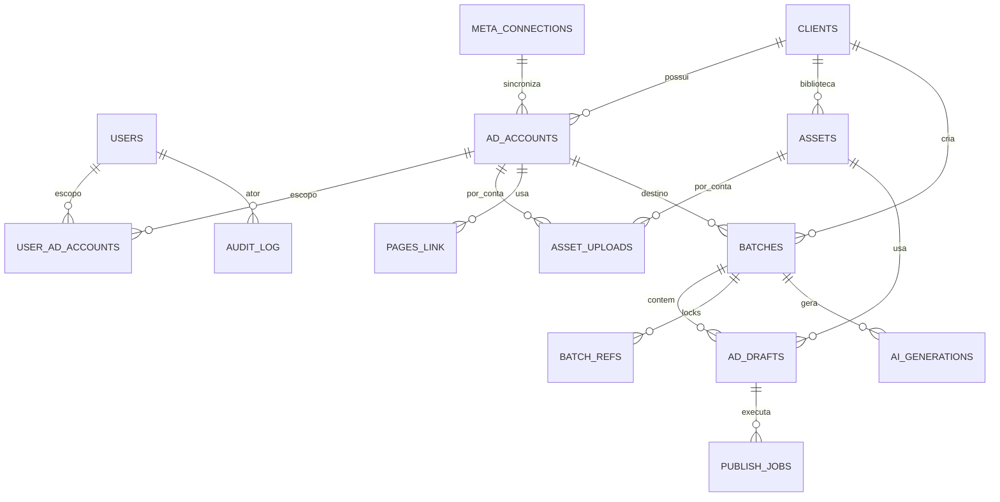

# Modelo de dados — feature 001

Postgres 16, Drizzle ORM. Convenções: `id uuid pk default gen_random_uuid()`, `created_at/updated_at timestamptz`, soft delete só onde indicado. IDs da Meta são `text` (podem exceder 64 bits).

## Diagrama


## Tabelas

### users
| coluna | tipo | notas |
|---|---|---|
| id | uuid | |
| email | text unique | domínio corporativo |
| name | text | |
| role | enum `admin, coordinator, manager, viewer` | |
| password_hash | text nullable | scrypt; login exige preenchido |
| active | bool | |

### user_ad_accounts
`user_id uuid`, `ad_account_id text` — PK composta. Admin e coordinator veem tudo; manager/viewer só o que estiver aqui.

### meta_connections
| coluna | tipo | notas |
|---|---|---|
| id | uuid | |
| business_id | text | BM |
| label | text | ex. "System User AdPub" |
| token_ciphertext | bytea | AES-256-GCM |
| token_iv | bytea | |
| token_expires_at | timestamptz null | null = sem expiração |
| scopes | text[] | |
| api_tier | enum `limited, full, unknown` | lido do header |
| status | enum `active, needs_attention, revoked` | |
| last_checked_at | timestamptz | |

### clients
| coluna | tipo | notas |
|---|---|---|
| id | uuid | |
| name | text | |
| voice_profile | jsonb | `{tone, audience, forbidden_terms[], allowed_claims[], examples[]}` |
| naming_template | text | `{cliente}_{objetivo}_{data:YYYYMMDD}_{criativo}_{formato}_{v}` |
| default_utm | jsonb | `{utm_source, utm_medium, utm_campaign, ...}` com tokens |
| policy_mode | enum `warn, block` | avisos bloqueiam? |
| landing_domains | text[] | validação de URL |
| advantage_creative_optout | bool | default true |

### ad_accounts
| coluna | tipo | notas |
|---|---|---|
| id | text pk | `act_123` |
| connection_id | uuid fk | |
| client_id | uuid fk null | |
| name, currency, timezone_name | text | |
| account_status | int | da Meta |
| default_page_id, default_ig_user_id, default_pixel_id | text null | |
| daily_ad_cap | int | default 100 |
| active_ads_count | int | p/ estimar quota |
| rate_usage | jsonb | último header lido |
| paused_until | timestamptz null | fila pausada |
| last_synced_at | timestamptz | |

### pages, instagram_accounts, pixels
Cache de ativos: `id text pk`, `name`, `connection_id`, `raw jsonb`, `synced_at`. Tabela `account_pages (ad_account_id, page_id)` para elegibilidade.

### campaigns_cache / adsets_cache
`id text pk`, `ad_account_id`, `name`, `objective` / `optimization_goal`, `status`, `effective_status`, `campaign_id` (adset), `raw jsonb`, `synced_at`. Usadas nos seletores "campanha existente".

### assets
| coluna | tipo | notas |
|---|---|---|
| id | uuid | |
| client_id | uuid fk | |
| sha256 | text | unique por cliente |
| kind | enum `image, video` | |
| storage_key | text | S3 |
| filename, mime | text | |
| width, height | int | |
| aspect_ratio | text | `1:1, 4:5, 9:16, 16:9, 1.91:1, other` |
| duration_ms | int null | vídeo |
| size_bytes | bigint | |
| source | enum `drive, upload` | |
| drive_file_id | text null | |
| validation | jsonb | `{status: ok|rejected, errors[], warnings[]}` |
| thumbnail_key | text null | |

### asset_uploads
`asset_id uuid`, `ad_account_id text`, `meta_image_hash text null`, `meta_video_id text null`, `video_status text null`, `uploaded_at` — unique `(asset_id, ad_account_id)`.

### batches
| coluna | tipo | notas |
|---|---|---|
| id | uuid | |
| client_id, ad_account_id | fk | |
| created_by | uuid fk users | |
| name | text | |
| briefing | text null | |
| mode | enum `ai, manual` | |
| plan | jsonb | `BatchPlan` (schema em `packages/shared`) |
| status | enum `draft, ready, blocked, queued, publishing, done, partial, failed, archived` | |
| options | jsonb | `{initial_status:'PAUSED', max_items, dry_run}` |
| duplicated_from | uuid null | |
| version | int | bloqueio otimista |

### ad_drafts (itens do lote)
| coluna | tipo | notas |
|---|---|---|
| id | uuid | |
| batch_id | uuid fk | |
| position | int | |
| campaign_ref | jsonb | `{kind:'existing', id}` ou `{kind:'new', key, spec:{name, objective, buying_type, budget?}}` |
| adset_ref | jsonb | idem, `spec:{name, optimization_goal, billing_event, targeting|advantage_audience, budget?, schedule?}` |
| format | enum `single_image, single_video, carousel` | |
| asset_ids | uuid[] | 1 ou N (carrossel) |
| copy | jsonb | `{primary_text, headline, description, cta, link, display_link, url_tags, cards?[]}` |
| name | text | nome do anúncio |
| page_id, ig_user_id | text | |
| status | enum `draft, blocked, ready, queued, uploading_media, ensuring_campaign, ensuring_adset, creating_creative, creating_ad, published, in_review, approved, disapproved, failed` | |
| validation | jsonb | `{errors[], warnings[], policy[]}` |
| meta_ids | jsonb | `{campaign_id, adset_id, creative_id, ad_id, image_hashes{}, video_ids{}}` |
| effective_status, review_feedback | text / jsonb | do poller |
| error | jsonb null | `{code, subcode, message, translated, action}` |
| attempts | int | |
| idempotency_key | text unique | |
| edited_fields | text[] | rastro de edição humana |
| version | int | |
| lease_owner, lease_until | text null / timestamptz null | exclusão mútua entre entregas simultâneas do mesmo job; dono por execução, expira e libera se o worker morrer |

### batch_refs (locks de objetos "novos")
`batch_id uuid`, `ref_key text` (ex. `campaign:frio-set`), `kind enum campaign|adset`, `meta_id text null`, `state enum pending|created|failed` — PK `(batch_id, ref_key)`. Criação usa `INSERT ... ON CONFLICT DO NOTHING RETURNING`; quem inseriu cria; os demais aguardam `meta_id`.

### publish_jobs
`id uuid`, `ad_draft_id fk`, `queue text`, `bull_job_id text`, `step text`, `state enum waiting|active|delayed|completed|failed`, `attempts int`, `next_run_at`, `last_error jsonb`, `started_at`, `finished_at`.

### meta_api_calls
`id bigserial`, `ad_account_id null`, `method`, `endpoint`, `api_version`, `status_code`, `error_code int null`, `error_subcode int null`, `latency_ms`, `usage jsonb` (headers), `ad_draft_id null`, `created_at`. Índice por `(ad_account_id, created_at)`. Retenção 90 dias.

### ai_generations
`id uuid`, `batch_id`, `purpose enum plan|copy|policy`, `prompt_version text`, `model text`, `input_hash text`, `input jsonb`, `output jsonb`, `input_tokens, output_tokens int`, `cost_usd numeric`, `latency_ms`, `feedback enum used|edited|rejected|null`. Unique `(purpose, prompt_version, input_hash)` para cache.

### audit_log
`id bigserial`, `actor_id uuid null` (null = sistema), `action text` (ex. `batch.publish`, `meta.ad.create`), `entity_type`, `entity_id`, `before jsonb`, `after jsonb`, `meta_request jsonb` (mascarado), `meta_response jsonb`, `ip`, `created_at`. Índices por `(entity_type, entity_id)` e `created_at`. Somente inserção.

## Máquina de estados — `ad_drafts.status`
```
draft ─validar─► ready | blocked
ready ─publicar─► queued
queued → uploading_media → ensuring_campaign → ensuring_adset → creating_creative → creating_ad → published
(qualquer etapa) ─erro não transiente─► failed ─reprocessar─► queued (retoma na etapa salva em publish_jobs.step)
published ─poller─► in_review → approved | disapproved
```
Invariantes: nunca voltar de `published` para etapas anteriores; `failed` mantém `meta_ids` parciais; `blocked` só sai por nova validação.

## Índices e regras
- `ad_drafts (batch_id, position)` unique; `ad_drafts (status)`; `ad_drafts (idempotency_key)` unique.
- `assets (client_id, sha256)` unique.
- `asset_uploads (asset_id, ad_account_id)` unique.
- Trigger: `batches.status` derivado dos itens (`done` se todos published/approved; `partial` se há failed; `publishing` se há ativos).
- RLS (se Supabase): políticas por `user_ad_accounts`; caso contrário, aplicar na API.
